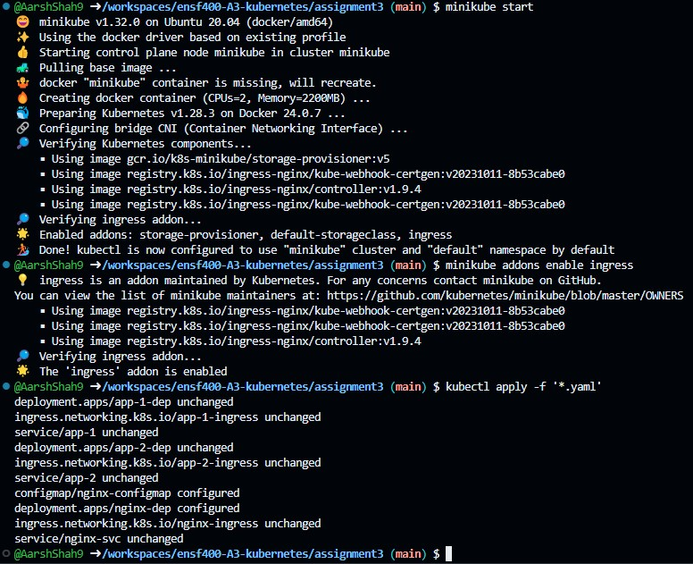
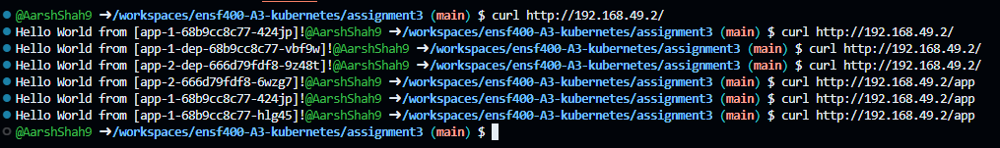
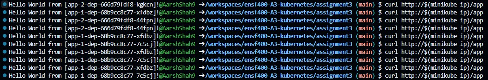

### Important Assumptions Made

- In my configuration I have left the /app accessible to load balance as 70/30 straight off of the app-1 and app-2 ingresses, and then the '/' endpoint to go through the nginx-ingress. I did this with consideration of the most recent updates on April 3 (the second update to the assignment), as putting all of the ingresses on '/' causes a confliction as the apps are already part of their own canary and adding another nginx ingress in there without the canary split will not work. Thus my assignment works based on the 1st update to the assignment.

### Instructions

- Run the following commands in order (ensure you are in the correct/ assignment 3 directory):

```bash
minikube start
minikube addons enable ingress
kubectl apply -f '*.yaml'
curl http://$(minikube ip)/
curl http://$(minikube ip)/app
```

Once you've ran these you should see an output similar to this:


Heres a sample of hitting both '/app' and '/'



Heres an example of hitting '/app' and having the load balancer do a 70/30 split.



- If something goes wrong run in the configuration you can always run the following and then rerun the above commands.

```bash
minikube delete
```
